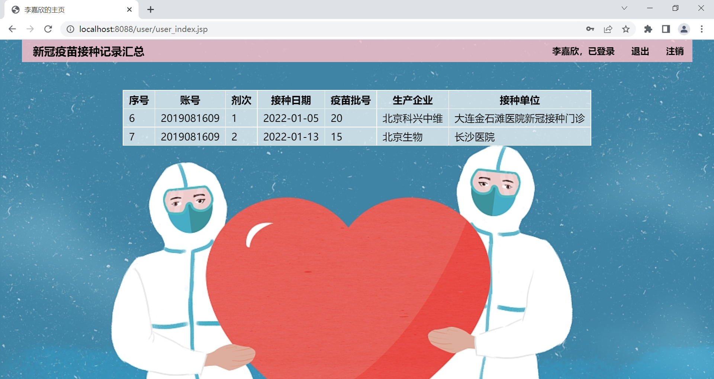
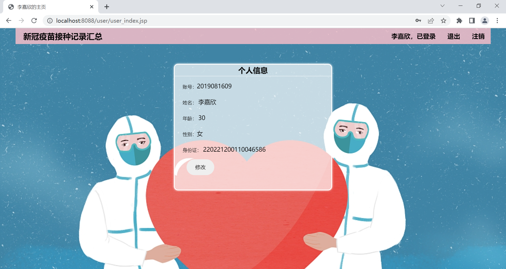
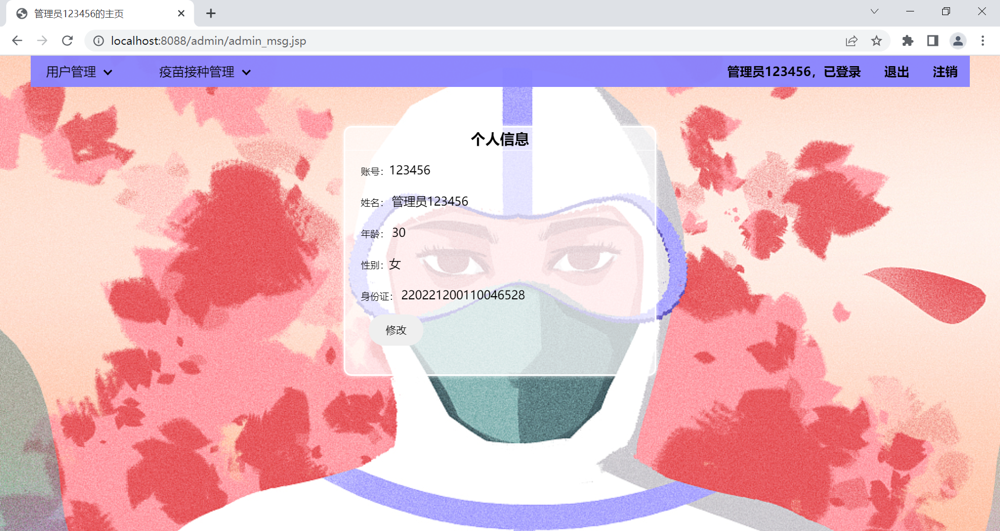
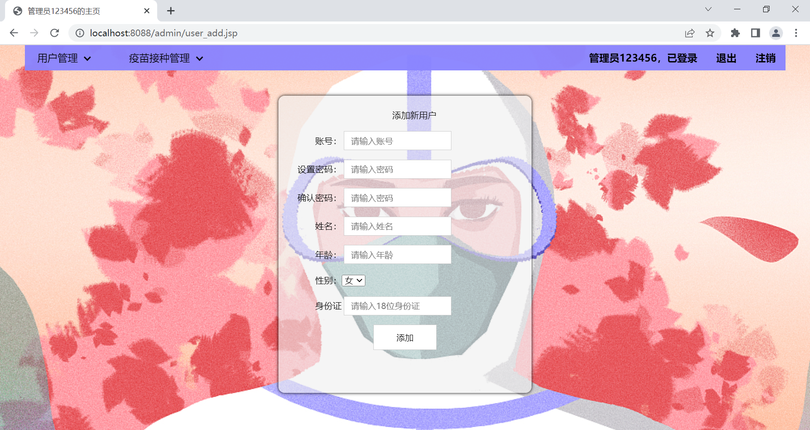
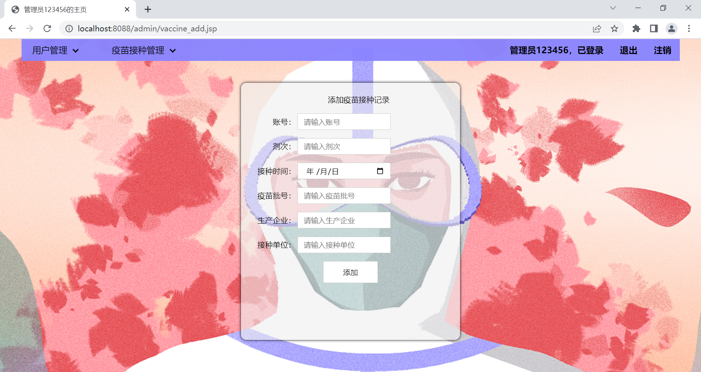
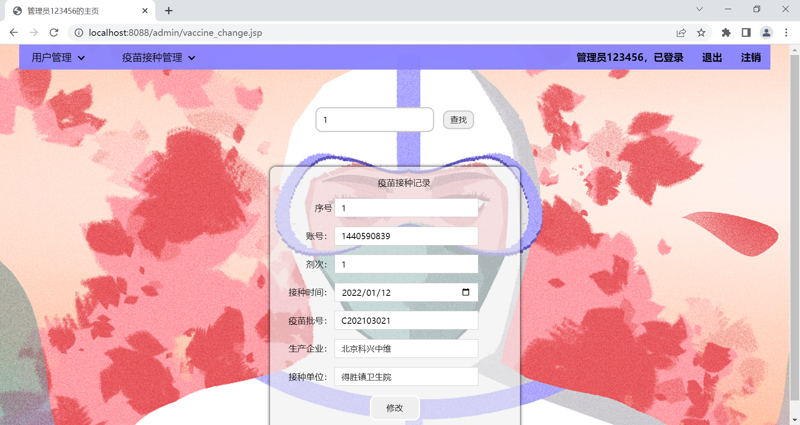
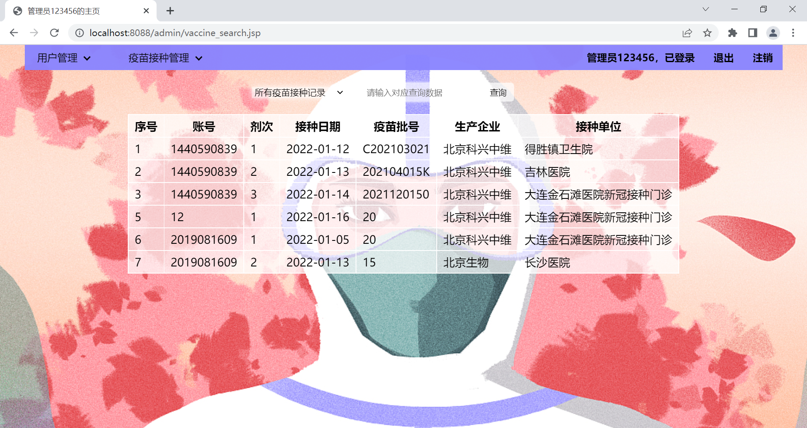

## 新冠疫苗接种统计平台

前端：HTML、CSS、JQuery

后端：SpringBoot框架+MySQL+MyBatis

（后端链接：https://gitee.com/labyrinth04/covid_-vaccination/tree/master）

服务器：Tomcat 9.0.39

### 系统角色

#### 普通用户

1. 查看自己的接种记录，不能看到别人的
2. 查看/编辑自己基础信息

#### 系统管理员

1. 查看用户列表，导入/编辑新用户信息
2. 操作疫苗接种记录，不局限于新增/查看/删除/编辑

### 功能需求

#### 系统注册/登录

1. 登录/注册
2. 从系统入口就区分管理员和普通用户

#### 疫苗接种记录

1. 新增疫苗接种记录

2. 疫苗接种情况列表，要求列表可以根据不同条件属性进行筛选、日期排序等等结合实际情况而定

3. 删除记录

4. 编辑疫苗接种记录

#### 用户

1. 个人信息管理。编辑个人资料、修改密码、注销账号

### 页面展示

#### 登录/注册页面

#### 用户页面

##### 用户首页

##### 用户个人信息修改

#### 管理员页面

##### 管理员主页

##### 修改管理员信息

##### 用户管理

###### 增加用户

###### 查找用户

##### 疫苗接种管理

###### 增加疫苗接种记录

###### 删除疫苗接种记录

###### 修改疫苗接种记录

###### 查询疫苗接种记录

